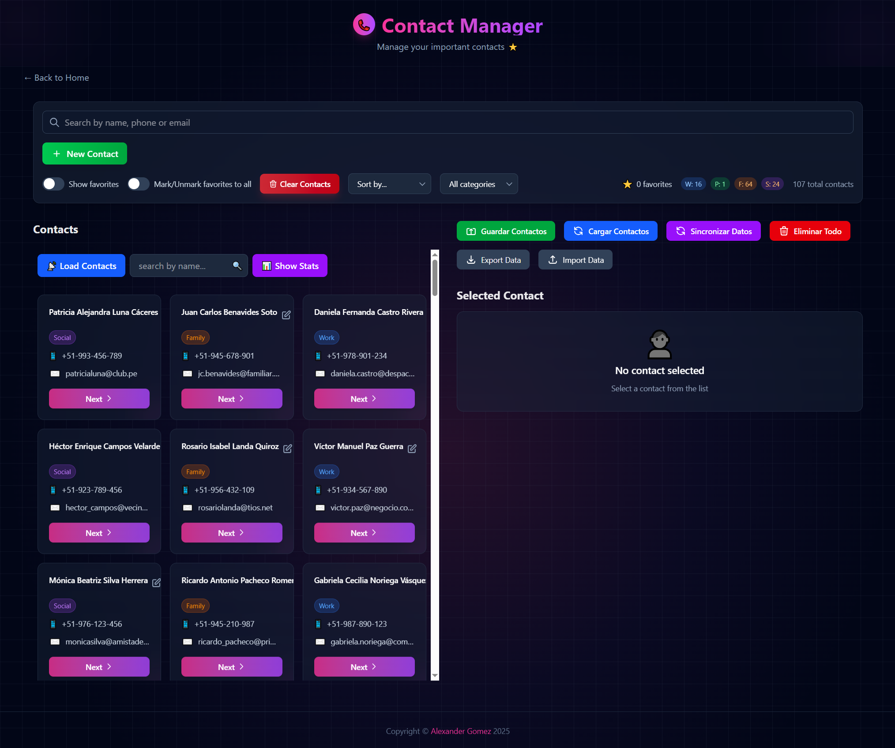
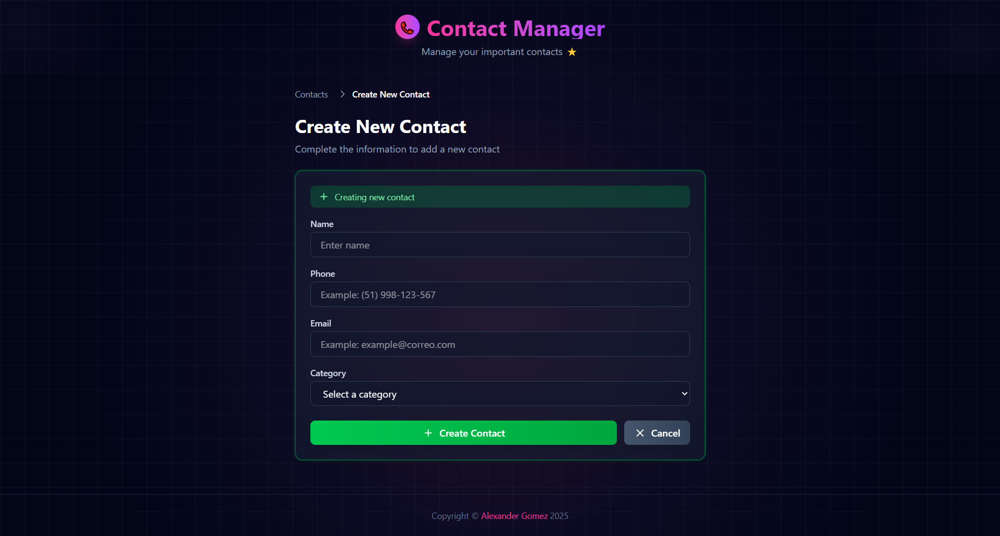
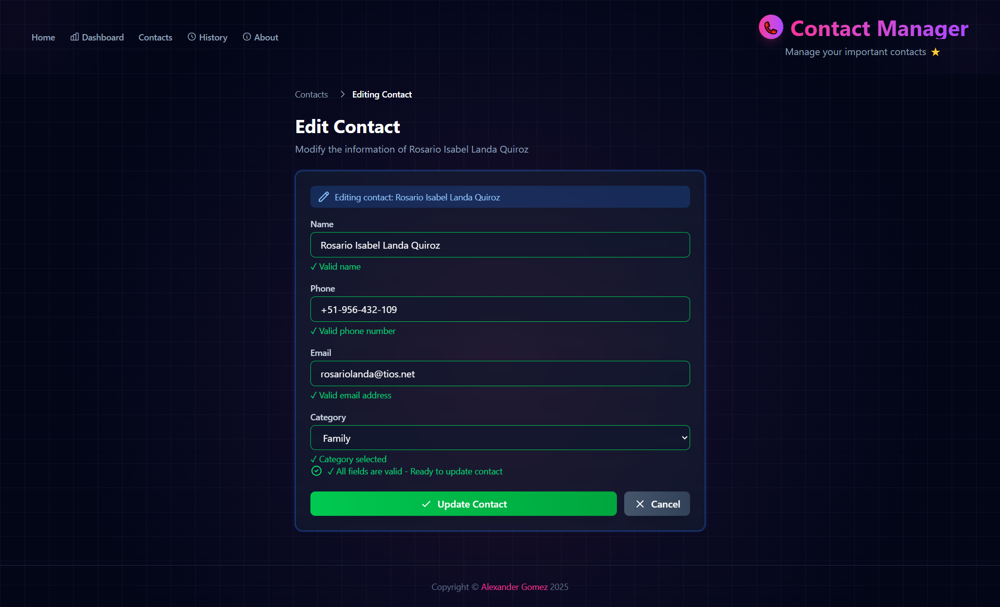

# 📱 Contact Manager - Aplicación Web Moderna

> **Una aplicación web completa para gestión de contactos desarrollada con React 19, Tailwind CSS y arquitectura moderna. Implementa patrones de diseño avanzados, integración con APIs externas y persistencia de datos local.**






[](https://reactjs.org/)
[](https://tailwindcss.com/)
[](https://vitejs.dev/)
[](https://developer.mozilla.org/en-US/docs/Web/JavaScript)

## 🚀 Características Principales

### ✨ Funcionalidades Core

- **CRUD Completo**: Operaciones completas de Crear, Leer, Actualizar y Eliminar contactos
- **Integración API**: Comunicación con APIs externas usando Fetch API y patrón Service Layer
- **Persistencia Local**: Sistema híbrido con LocalStorage y sincronización automática
- **Búsqueda Inteligente**: Filtrado en tiempo real por nombre, teléfono y email
- **Categorización**: Sistema de categorías con código de colores (Trabajo, Personal, Familia)
- **Sistema de Favoritos**: Marcado y filtrado de contactos favoritos
- **Ordenamiento Avanzado**: Múltiples criterios de ordenamiento (alfabético, favoritos, fecha)

### 🎯 Funcionalidades Avanzadas

- **Validación en Tiempo Real**: Validación de formularios con feedback inmediato
- **Sistema de Notificaciones**: Notificaciones modernas con Sonner
- **Exportación/Importación**: Respaldo completo de datos en formato JSON
- **Responsive Design**: Interfaz adaptable a todos los dispositivos
- **Dark Mode**: Tema oscuro moderno y elegante
- **Prevención de Duplicados**: Sistema inteligente para evitar contactos duplicados

## 🛠️ Stack Tecnológico

### Frontend

- **React 19** - Framework principal con Hooks y componentes funcionales
- **Tailwind CSS 4** - Framework de utilidades CSS para diseño moderno
- **Vite 7** - Build tool y dev server de alta velocidad
- **JavaScript ES6+** - Sintaxis moderna y características avanzadas

### Herramientas de Desarrollo

- **ESLint 9** - Linting y análisis de código estático
- **Sonner** - Sistema de notificaciones moderno y personalizable
- **Fetch API** - Cliente HTTP nativo para comunicación con APIs
- **LocalStorage API** - Persistencia de datos del lado del cliente

### Patrones y Arquitectura

- **Service Layer Pattern** - Separación de lógica de negocio
- **Component Composition** - Arquitectura modular y reutilizable
- **Custom Hooks** - Lógica reutilizable y separación de responsabilidades
- **Controlled Components** - Gestión de estado predecible

## 📋 Instalación y Configuración

### Prerrequisitos

```bash
Node.js >= 18.0.0
npm >= 8.0.0
```

### Instalación Rápida

```bash
# Clonar el repositorio
git clone https://github.com/AlexanderG8/contact-manager.git
cd contact-manager

# Instalar dependencias
npm install

# Configurar variables de entorno
cp .env.example .env
# Editar .env con tu configuración de API

# Iniciar servidor de desarrollo
npm run dev
```

### Scripts Disponibles

```bash
npm run dev      # Servidor de desarrollo
npm run build    # Build de producción
npm run preview  # Preview del build
npm run lint     # Análisis de código
```

## 🏗️ Arquitectura del Proyecto

### Estructura de Directorios

```
src/
├── components/          # Componentes reutilizables
│   ├── ContactCard.jsx     # Tarjeta de contacto
│   ├── ContactForm.jsx     # Formulario de contacto
│   ├── ContactList.jsx     # Lista de contactos
│   ├── Filters.jsx         # Componente de filtros
│   └── ...
├── pages/              # Páginas principales
│   ├── ContactsPage.jsx    # Página principal de contactos
│   ├── ContactDetailPage.jsx
│   └── ...
├── services/           # Capa de servicios
│   └── contactService.js   # Servicio de contactos
├── utils/              # Utilidades
└── assets/             # Recursos estáticos
```

### Patrón Service Layer

```javascript
// Ejemplo de implementación del Service Layer
class ContactService {
  async fetchContacts() {
    // Lógica de comunicación con API
    // Transformación de datos
    // Manejo de errores
  }
  
  async createContact(contact) {
    // Validación y creación
  }
  
  // Más métodos CRUD...
}
```

## 💡 Características Técnicas Destacadas

### 🔄 Sistema de Sincronización

- **Carga Automática**: Prioridad LocalStorage → API → Datos por defecto
- **Sincronización Manual**: Botón para actualizar desde API
- **Persistencia Híbrida**: Combinación de almacenamiento local y remoto

### 🎨 Experiencia de Usuario

- **Interfaz Intuitiva**: Diseño moderno con Tailwind CSS
- **Feedback Visual**: Notificaciones y estados de carga
- **Navegación Fluida**: Breadcrumbs y transiciones suaves
- **Validación en Tiempo Real**: Feedback inmediato en formularios

### 🔧 Optimizaciones de Rendimiento

- **Memoización**: useMemo para operaciones costosas
- **Lazy Loading**: Carga perezosa de componentes
- **Batch Updates**: Agrupación de actualizaciones de estado
- **Code Splitting**: División de código para mejor rendimiento

## 📊 Funcionalidades Implementadas

### ✅ Gestión de Contactos

- [x] Crear contactos con validación completa
- [x] Editar contactos con formulario precargado
- [x] Eliminar contactos con confirmación
- [x] Ver detalles completos de contactos
- [x] Sistema de favoritos

### ✅ Filtrado y Búsqueda

- [x] Búsqueda en tiempo real
- [x] Filtro por categorías
- [x] Filtro por favoritos
- [x] Ordenamiento múltiple
- [x] Resaltado de términos de búsqueda

### ✅ Persistencia de Datos

- [x] Guardado automático en LocalStorage
- [x] Sincronización con API externa
- [x] Exportación/Importación JSON
- [x] Sistema de respaldo automático

### ✅ Experiencia de Usuario

- [x] Notificaciones modernas con Sonner
- [x] Validación en tiempo real
- [x] Responsive design
- [x] Dark mode
- [x] Indicadores de progreso

## 🎯 Casos de Uso

### Para Desarrolladores

- **Ejemplo de Arquitectura Moderna**: Implementación de patrones de diseño actuales
- **Best Practices**: Código limpio y mantenible
- **Testing Ground**: Plataforma para probar nuevas tecnologías

### Para Usuarios Finales

- **Gestión Personal**: Organización de contactos personales
- **Uso Profesional**: Gestión de contactos de trabajo
- **Backup de Datos**: Respaldo seguro de información de contactos

<!--
## 🚀 Próximas Funcionalidades

- [ ] **Autenticación**: Sistema de login y registro
- [ ] **Sincronización en Tiempo Real**: WebSockets para actualizaciones live
- [ ] **Modo Offline**: PWA con funcionamiento sin conexión
- [ ] **Integración con APIs**: Google Contacts, Outlook
- [ ] **Analytics**: Dashboard con estadísticas de uso
- [ ] **Temas Personalizables**: Sistema de temas dinámico -->

## 👨‍💻 Autor

**Alexander Gomez**
- LinkedIn: [Alexander Gomez](https://www.linkedin.com/in/marcello-alexander-gomez-gomez-130587268/)
- GitHub: [@AlexanderG8](https://github.com/AlexanderG8)
- Portfolio: [Mi Portfolio](https://alexanderg8.github.io/my-portfolio-web/)

---

⭐ **¡Si te gusta este proyecto, no olvides darle una estrella!** ⭐

*Desarrollado con ☕ y usando React 19 y las mejores prácticas de desarrollo moderno.*
