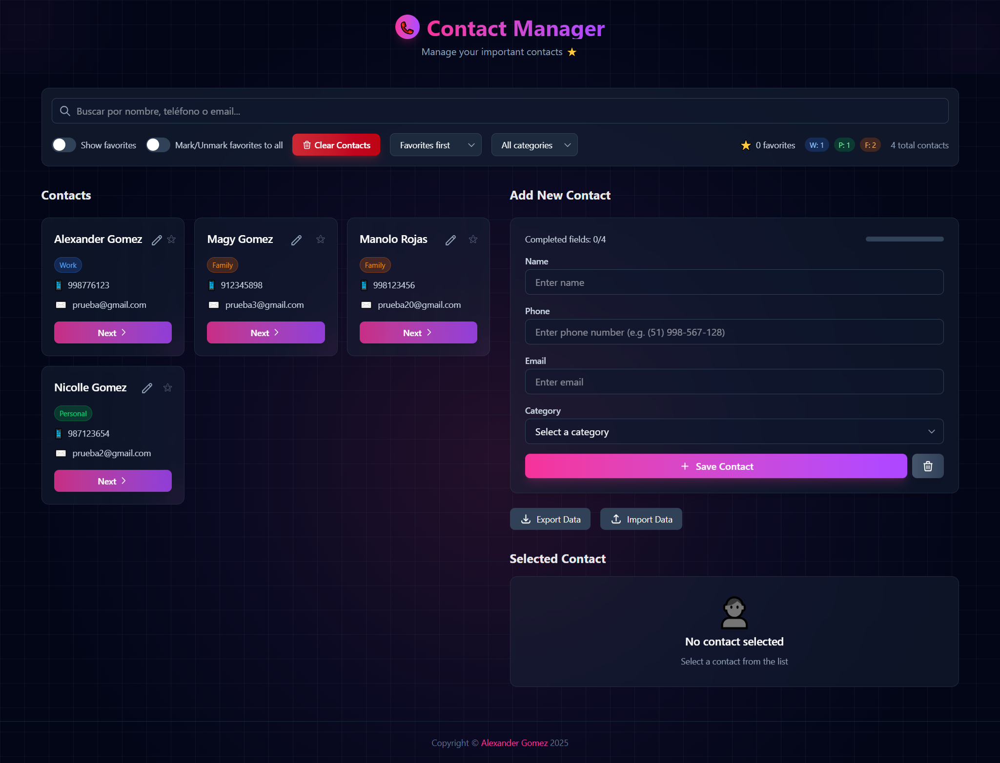

# Gestor de Contactos

Una aplicación moderna para gestionar contactos personales con múltiples funcionalidades avanzadas como categorización, búsqueda, ordenamiento, favoritos y persistencia local.



## Stack Tecnológico

- **Frontend**: React 19
- **Estilos**: Tailwind CSS 4
- **Bundler/Dev Server**: Vite 7
- **Lenguaje**: JavaScript (ES6+)
- **Linting**: ESLint 9

## Instrucciones de Instalación

### Requisitos Previos

- Node.js (versión 18 o superior)
- npm (incluido con Node.js)

### Pasos de Instalación

1. Clona el repositorio:
   ```bash
   git clone https://github.com/AlexanderG8/contact-manager.git
   cd contact-manager
   ```

2. Instala las dependencias:
   ```bash
   npm install
   ```

3. Inicia el servidor de desarrollo:
   ```bash
   npm run dev
   ```

4. Abre tu navegador en `http://localhost:5173`

## Instrucciones de Uso

### Gestión de Contactos

- **Añadir Contacto**: Completa el formulario con nombre, teléfono, email y categoría, luego haz clic en "Save Contact".
- **Editar Contacto**: Haz clic en el icono de edición (lápiz) en cualquier tarjeta de contacto para modificar sus datos.
- **Ver Detalles**: Haz clic en cualquier contacto para ver sus detalles completos en el panel lateral.
- **Marcar Favorito**: Utiliza el icono de estrella para marcar/desmarcar contactos como favoritos.

### Filtros y Búsqueda

- **Búsqueda**: Utiliza el campo de búsqueda para filtrar contactos por nombre, teléfono o email.
- **Filtro por Favoritos**: Activa el interruptor "Show favorites" para mostrar solo los contactos favoritos.
- **Filtro por Categoría**: Selecciona una categoría del desplegable para filtrar contactos.
- **Ordenamiento**: Utiliza el desplegable "Sort by..." para ordenar los contactos por diferentes criterios.

### Respaldo de Datos

- **Exportar**: Haz clic en "Export Data" para descargar un archivo JSON con todos tus contactos y configuraciones.
- **Importar**: Haz clic en "Import Data" para cargar un archivo JSON previamente exportado.

## Funcionalidades Implementadas

### Funcionalidades Core

- Añadir, editar, ver y buscar contactos
- Interfaz de usuario intuitiva y responsive
- Visualización de contactos en tarjetas con información relevante
- Selección de contacto para ver detalles completos

### Retos Extra

1. **Búsqueda Inteligente**
   - Búsqueda en tiempo real por nombre, teléfono o email
   - Resaltado visual de los términos de búsqueda en los resultados

2. **Ordenamiento Avanzado**
   - Ordenar alfabéticamente (A-Z o Z-A)
   - Ordenar por favoritos primero
   - Ordenar por fecha de creación (más recientes primero)

3. **Validación Avanzada de Teléfono**
   - Validación de formato de teléfono en tiempo real
   - Soporte para diferentes formatos (espacios, guiones, paréntesis)

### Retos Autónomos

1. **Indicador de Progreso del Formulario**
   - Contador visual de campos completados
   - Barra de progreso que se actualiza en tiempo real

2. **Selección Automática y Notificación Temporal**
   - Selección automática del contacto recién añadido
   - Notificación temporal con animación fade-in/fade-out

3. **Prevención de Contactos Duplicados**
   - Validación para evitar nombres duplicados
   - Mensaje de error específico para contactos duplicados

### Retos Finales

1. **Categorías de Contactos**
   - Asignación de categorías (Trabajo, Personal, Familia)
   - Filtrado por categoría
   - Visualización con código de colores por categoría
   - Contadores de contactos por categoría

2. **Persistencia Local**
   - Almacenamiento automático en localStorage
   - Carga de datos al iniciar la aplicación
   - Exportación e importación de datos
   - Manejo de errores en operaciones de almacenamiento

3. **Modo Edición**
   - Edición de contactos existentes
   - Validación en tiempo real durante la edición
   - Confirmación antes de descartar cambios no guardados
   - Indicador visual del modo edición

## Decisiones Técnicas y Patrones Aplicados

### Arquitectura de Componentes

- **Componentes Funcionales**: Uso exclusivo de componentes funcionales con React Hooks para gestión de estado y efectos secundarios.
- **Prop Drilling Controlado**: Paso de props entre componentes de forma estructurada para mantener un flujo de datos predecible.

### Gestión de Estado

- **useState**: Para gestión de estado local en componentes.
- **useEffect**: Para efectos secundarios como cargar/guardar datos en localStorage.
- **useMemo**: Para optimizar el rendimiento en operaciones costosas como filtrado y ordenamiento.

### Patrones de Diseño

- **Controlled Components**: Todos los inputs del formulario son componentes controlados.
- **Conditional Rendering**: Renderizado condicional basado en estado para mostrar/ocultar elementos.
- **Lifting State Up**: El estado principal se mantiene en el componente App y se pasa a los componentes hijos.
- **Composition**: Composición de componentes pequeños para crear interfaces más complejas.

### Optimizaciones

- **Memoización**: Uso de useMemo para evitar recálculos innecesarios en filtrado y ordenamiento.
- **Lazy Initialization**: Inicialización perezosa de estado para cargar datos desde localStorage.
- **Batch Updates**: Agrupación de actualizaciones de estado para reducir renderizados.

### Manejo de Errores

- **Try-Catch**: Implementación de bloques try-catch para operaciones propensas a errores.
- **Validación Defensiva**: Comprobación de existencia de datos antes de acceder a propiedades.
- **Feedback Visual**: Notificaciones para informar al usuario sobre errores o acciones exitosas.

### Estilizado

- **Utility-First CSS**: Uso de Tailwind CSS para un desarrollo rápido y consistente.
- **Responsive Design**: Diseño adaptable a diferentes tamaños de pantalla.
- **Dark Mode**: Interfaz con tema oscuro para mejor experiencia visual.
